# SAP CAP Bookshop – Kurulum

Bu rehber, Git, Node.js, SAP CAP ve proje daha önce kurulmamış bir Windows bilgisayarda uygulamayı GitHub'dan indirip çalıştırmak için hazırlanmıştır. Adımları sırayla uygulayın. Özellikle SQLite deploy tamamlanmadan uygulamayı başlatmayın.

## 1. Gereksinimler

Kurulması gereken programlar:

- Git for Windows
- Visual Studio Code
- Node.js 22 veya üzeri
- Node.js ile birlikte kurulan npm
- GitHub ve npm paketlerine erişebilen internet bağlantısı

Projede kullanılan temel paketler:

- `@sap/cds` 10.0.5
- `@cap-js/sqlite` 3.0.2

`@sap/cds` 10, Node.js `>=22` gerektirir. Projede `@sap/cds-dk` bağımlılığı bulunmadığı için paket belirtilmeden yapılan doğrudan CDS CLI çağrısı temiz bilgisayarda çalışmaz. Bu rehber, CDS geliştirme aracını gerektiğinde geçici olarak indiren `npx.cmd -p @sap/cds-dk@10 ...` biçimini kullanır. Global `@sap/cds-dk` kurulumu zorunlu değildir.

Ayrı bir SQLite programı veya veritabanı sunucusu kurulmaz. SQLite desteği projenin `@cap-js/sqlite` bağımlılığından gelir.

## 2. Git Kurulumu

1. <https://git-scm.com/download/win> adresini açın.
2. Git for Windows kurulum dosyasını indirin.
3. Kurulumu varsayılan seçeneklerle tamamlayın.
4. Kurulumdan sonra Visual Studio Code açıksa kapatıp yeniden açın.

İndirme sayfasında **Windows** sekmesindeki güncel x64 sürüm bağlantısını kullanın:

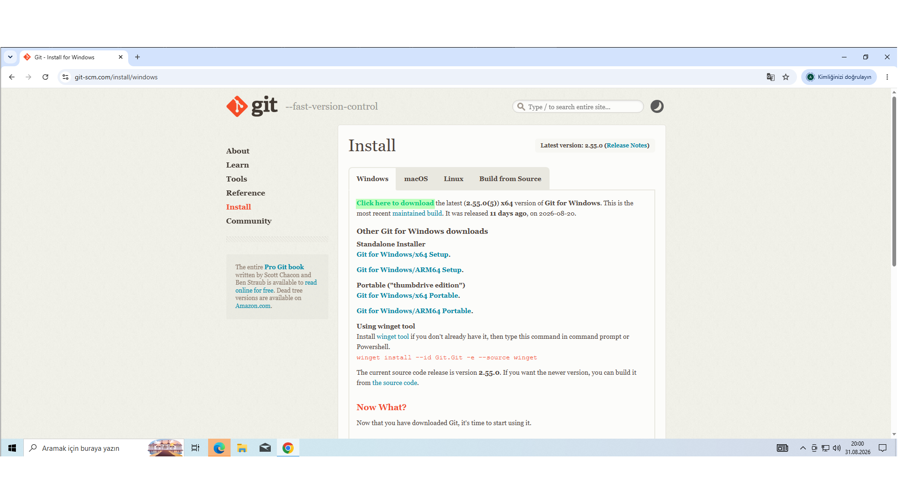

Git, repository'yi GitHub'dan klonlamak ve daha sonra güncellemeleri almak için gereklidir.

## 3. Visual Studio Code Kurulumu

1. <https://code.visualstudio.com/download> adresini açın.
2. Windows için Visual Studio Code kurulum dosyasını indirin.
3. Kurulumu tamamlayın.
4. Visual Studio Code'u açın.

İndirme sayfasında Windows için uygun kullanıcı veya sistem kurulum dosyasını seçin:

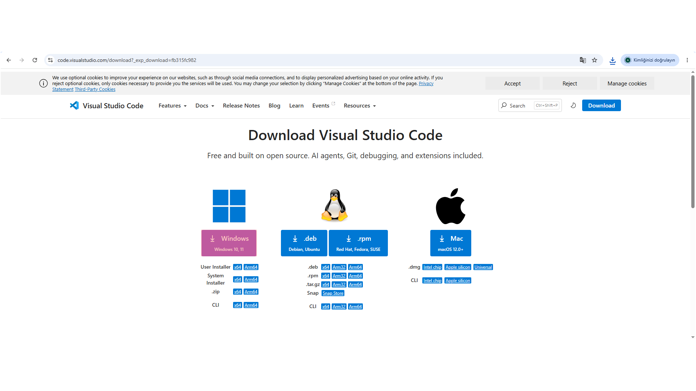

Projeyi klonlama, proje klasörünü açma ve komutları çalıştırma işlemleri Visual Studio Code üzerinden yapılacaktır.

## 4. Node.js Kurulumu

1. <https://nodejs.org/en/download> adresini açın.
2. Node.js 22 veya daha yeni bir LTS sürümünü indirin.
3. Kurulum sırasında npm ve PATH seçeneklerini etkin bırakın.
4. Kurulum tamamlandığında Visual Studio Code'u kapatıp yeniden açın.

Windows ve bilgisayarınızın mimarisi seçiliyken **Windows Installer (.msi)** düğmesini kullanın:

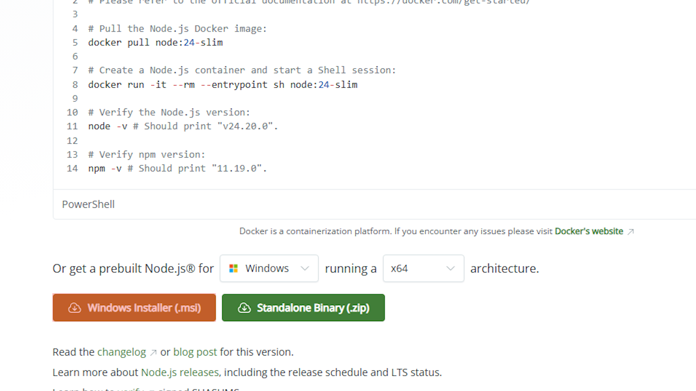

Node.js 20 veya daha eski bir sürüm kullanmayın; projedeki CAP 10 bağımlılığı Node.js 22 veya üzerini gerektirir.

## 5. Kurulumların Doğrulanması

Visual Studio Code'da terminali açın. Aşağıdaki komutlar herhangi bir klasörde çalıştırılabilir:

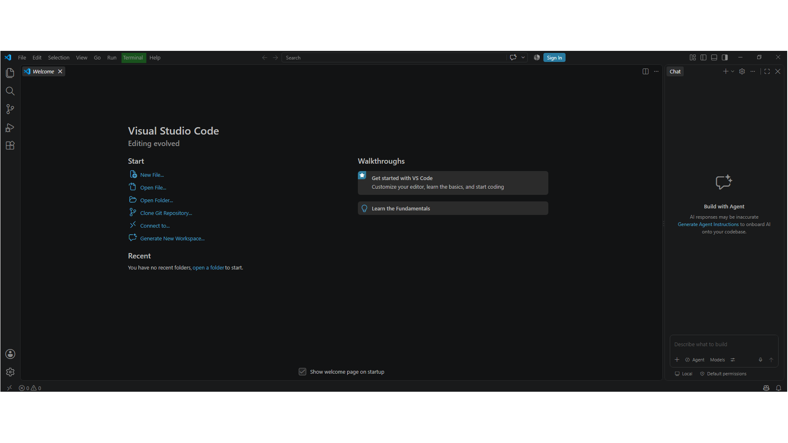

```powershell
git --version
node --version
npm.cmd --version
```

Beklenen sonuçlar:

- `git --version` bir Git sürümü göstermelidir.
- `node --version` çıktısı `v22` veya daha yüksek olmalıdır.
- `npm.cmd --version` bir npm sürümü göstermelidir.

Terminalde Git, Node.js ve npm sürümleri aşağıdakine benzer şekilde görünmelidir:

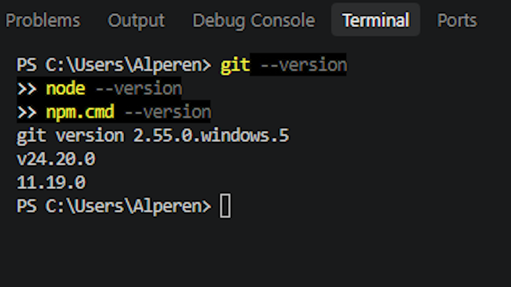

PowerShell'de `npm` komutu `npm.ps1 cannot be loaded` hatası verebilir. ExecutionPolicy ayarını değiştirmeyin; bu rehberdeki `npm.cmd` ve `npx.cmd` komutlarını kullanın.

## 6. Projeyi GitHub'dan Klonlama

1. Visual Studio Code'da `Ctrl+Shift+P` tuşlarına basın.
2. Açılan Command Palette'e `Git: Clone` yazıp **Git: Clone** komutunu seçin.

   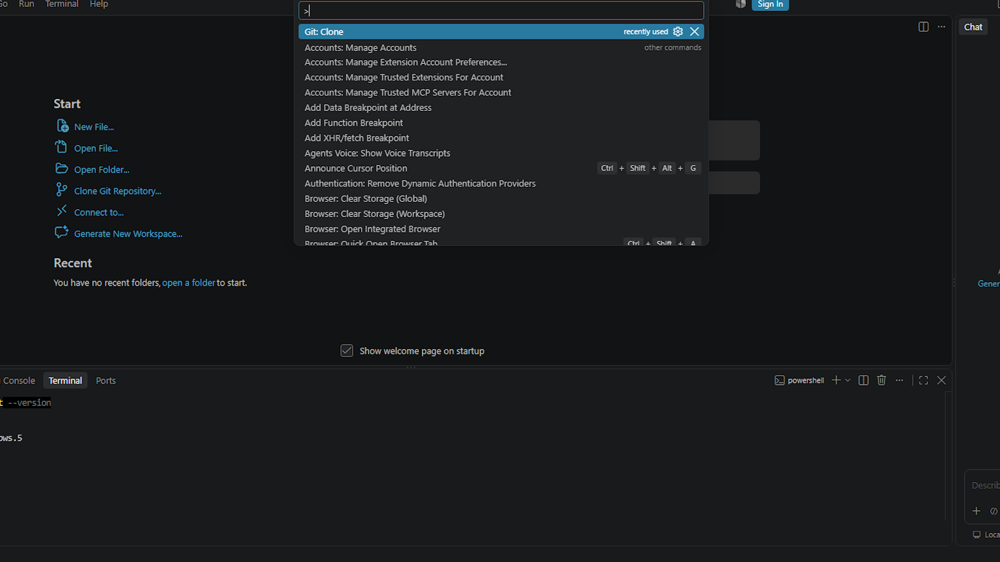

3. Aşağıdaki gerçek repository adresini yapıştırın:

   ```text
   https://github.com/Alpas1263/sap-cap-bookshop.git
   ```

   URL'yi girdikten sonra **Clone from URL** seçeneğini onaylayın:

   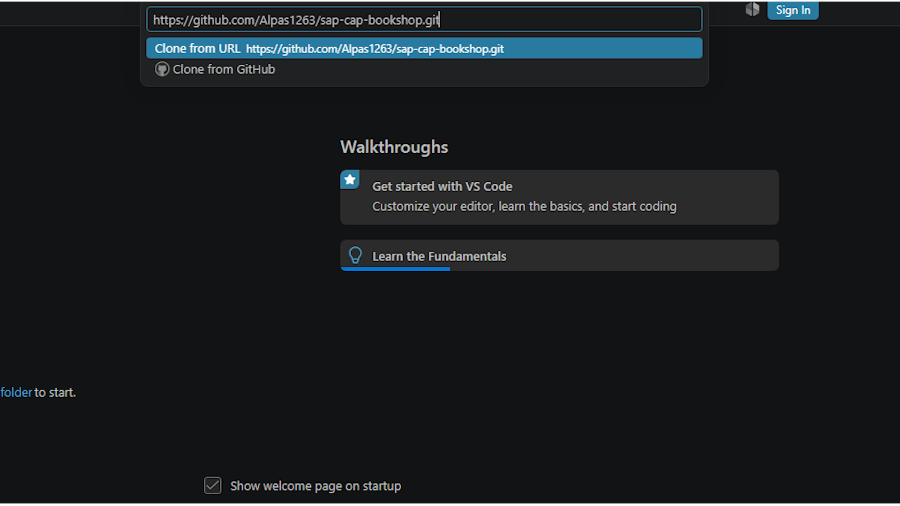

4. Projenin indirileceği üst klasörü seçin. VS Code burada `sap-cap-bookshop` klasörünü oluşturur.
5. Klonlama tamamlanınca **Open** seçeneğine basın.

   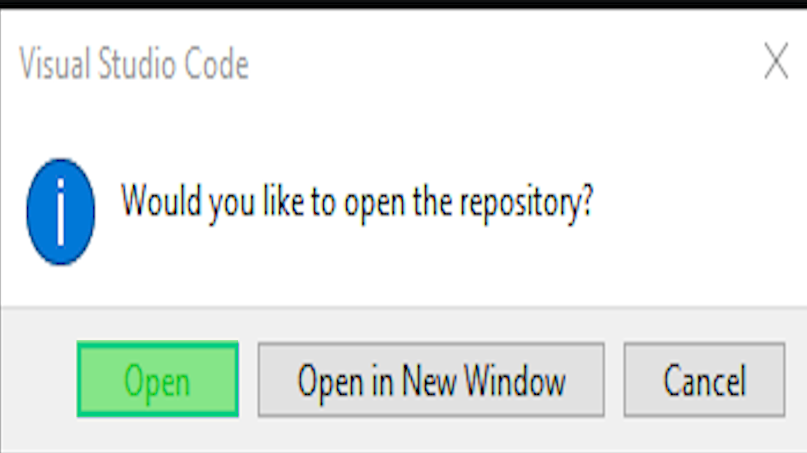

6. Güven sorusu gösterilirse repository adresini kontrol ettikten sonra **Yes, I trust the authors** seçeneğini kullanın.

Alternatif olarak VS Code terminalinde, projeyi koymak istediğiniz üst klasörde şu komut kullanılabilir:

```powershell
git clone https://github.com/Alpas1263/sap-cap-bookshop.git
```

## 7. Proje Klasörünü Açma

VS Code'da **File > Open Folder** ile klonlanan `sap-cap-bookshop` klasörünü açın. Ardından **Terminal > New Terminal** seçeneğiyle yeni terminal oluşturun.

Terminal satırı yaklaşık şu klasörü göstermelidir:

```text
C:\Users\KULLANICI_ADINIZ\...\sap-cap-bookshop>
```

Doğru proje kökünde olduğunuzu doğrulayın:

```powershell
Get-Location
Test-Path .\package.json
Get-ChildItem
```

`Test-Path .\package.json` çıktısı `True` olmalıdır. Dosya listesinde en az `package.json`, `package-lock.json`, `app`, `db`, `srv` ve `test` görünmelidir. Bundan sonraki bütün proje komutları `package.json` dosyasının bulunduğu bu klasörde çalıştırılmalıdır.

## 8. npm Bağımlılıklarını Kurma

**Çalışma klasörü:** `...\sap-cap-bookshop>`

Repository'de `package-lock.json` bulunduğu için temiz kurulumda kilitlenmiş paket sürümlerini kullanan şu komutu çalıştırın:

```powershell
npm.cmd ci
```

Komutu proje kökünü gösteren terminal satırında çalıştırın:


Komut başarıyla bitmeden sonraki adıma geçmeyin. İşlem sonunda `node_modules` klasörü oluşur:

```powershell
Test-Path .\node_modules
Test-Path .\node_modules\@sap\cds
Test-Path .\node_modules\@cap-js\sqlite
```

Başarılı kurulumda bu üç kontrolün sonucu da `True` görünür:

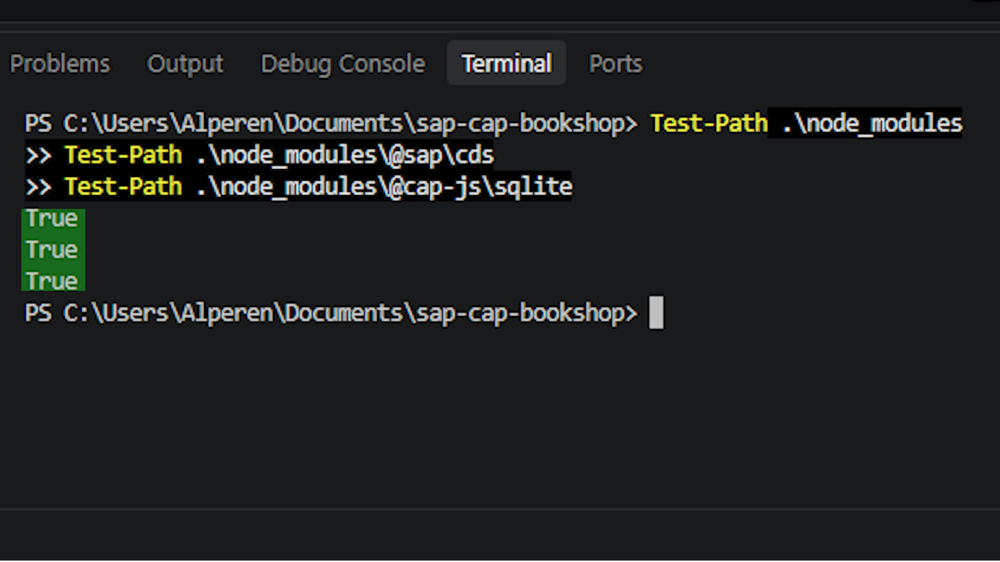

Üç komut da `True` döndürmelidir. `node_modules` GitHub'dan gelmez; `npm.cmd ci` tarafından yerelde oluşturulur ve `.gitignore` nedeniyle Git'e eklenmez.

## 9. SAP CAP/CDS Aracını Doğrulama

**Çalışma klasörü:** `...\sap-cap-bookshop>`

Projede `@sap/cds-dk` bağımlılığı ve doğrudan çalıştırılabilir yerel `cds` komutu yoktur. Bu nedenle aşağıdaki biçimi kullanın:

```powershell
npx.cmd -p @sap/cds-dk@10 cds --version
```

İlk kullanımda npm şuna benzer bir onay sorusu gösterebilir:

```text
Need to install the following packages:
@sap/cds-dk@10.x.x
Ok to proceed? (y)
```

Bu soru görüntülendiğinde paket adı `@sap/cds-dk@10` olarak görünmelidir:

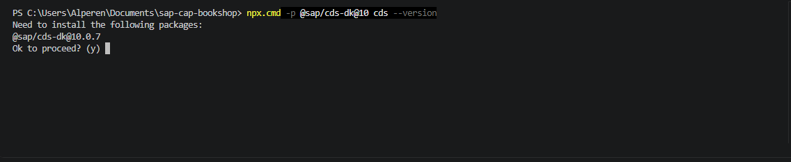

`y` yazıp `Enter` tuşuna basın. Komut CAP/CDS sürüm bilgilerini göstermelidir. Global `@sap/cds-dk` kurmayın.

`-p @sap/cds-dk@10` bölümünü komuttan çıkarmayın. Paket belirtilmeden yapılan çağrı temiz bilgisayarda `npm error could not determine executable to run` hatası verebilir; çünkü projedeki `@sap/cds` paketi `cds` adlı genel CLI çalıştırıcısını sağlamaz.

## 10. SQLite Veritabanını Oluşturma

**Çalışma klasörü:** `...\sap-cap-bookshop>`

Önce hâlâ doğru klasörde olduğunuzu kontrol edin:

```powershell
Test-Path .\package.json
Test-Path .\db\schema.cds
```

İki sonuç da `True` ise kalıcı SQLite veritabanını oluşturun:

```powershell
npx.cmd -p @sap/cds-dk@10 cds deploy --to sqlite
```

İlk CDS komutunda henüz onay vermediyseniz npm paket indirme sorusuna `y` ile onay verin. Başarılı çıktının sonunda şuna benzer bir satır görülmelidir:

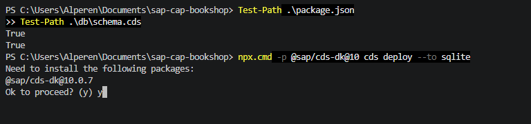

```text
successfully deployed to db.sqlite
```

Deploy tamamlandığında CSV başlangıç verileri işlenir ve terminalde başarı satırı görünür:


Komut başarısız olursa uygulamayı başlatmayın. Önce hata mesajını çözün ve deploy komutunu yeniden çalıştırın.

Proje kökündeki `db.sqlite` dosyasını doğrulayın:

```powershell
Test-Path .\db.sqlite
Get-Item .\db.sqlite | Select-Object Name, Length, LastWriteTime
```

`Test-Path` sonucu kesinlikle `True` olmalı ve dosya uzunluğu sıfırdan büyük görünmelidir. `db.sqlite`, `.gitignore` içindeki `*.sqlite` kuralı nedeniyle GitHub'dan gelmez; bu deploy adımında yerelde oluşturulur.

## 11. Başlangıç Verilerinin Yüklendiğini Doğrulama

Deploy komutu `db/schema.cds` modelini oluştururken `db/data/` altındaki yedi CSV dosyasını otomatik işler. Elle CSV içe aktarmayın.

Temiz deploy sonrasında kaynak CSV'lere göre beklenen veriler:

- 5 kitap
- 4 yazar
- 5 tür
- 3 para birimi (`EUR`, `GBP`, `USD`)

Başlangıç kitapları:

1. Wuthering Heights
2. Jane Eyre
3. The Raven
4. Eleonora
5. Catweazle

Başlangıç yazarları Emily Brontë, Charlotte Brontë, Edgar Allan Poe ve Richard Carpenter'dır. Türler Fiction, Drama, Fantasy, Romance ve Mystery'dir.

Asıl HTTP doğrulaması uygulama başlatıldıktan sonra 14. bölümde yapılacaktır.

## 12. Uygulamayı Başlatma

**Çalışma klasörü:** `...\sap-cap-bookshop>`

Başlatmadan önce veritabanının mevcut olduğunu tekrar kontrol edin:

```powershell
Test-Path .\package.json
Test-Path .\db.sqlite
```

İki çıktı da `True` değilse devam etmeyin. Doğruysa uygulamayı başlatın:

```powershell
npm.cmd start
```

Bu komut `package.json` içindeki `cds-serve` scriptini çalıştırır. Terminalde aşağıdakine benzer bilgiler görünmelidir:

```text
connect to db > sqlite { url: 'db.sqlite' }
serving AdminService at: [ '/admin' ]
serving CatalogService at: [ '/browse' ]
server listening on { url: 'http://localhost:4004' }
```

Terminali açık bırakın. Komut hata verirse 19. Sorun Giderme bölümünü kullanın.

Geliştirme sırasında dosya değişikliklerini izleyen alternatif komut şudur:

```powershell
npm.cmd run watch
```

Normal kurulum doğrulaması için `npm.cmd start` yeterlidir; iki başlatma komutunu aynı anda çalıştırmayın.

## 13. Tarayıcıdan Açma

Sunucu çalışırken Edge, Chrome veya başka bir tarayıcıda şu adresi açın:

<http://localhost:4004/>

Bu adres `app/` klasöründeki kitap yönetimi arayüzünü gösterir. `https://` kullanmayın.

Servisleri ayrı ayrı kontrol etmek için:

- Kitaplar: <http://localhost:4004/admin/Books>
- Yazarlar: <http://localhost:4004/admin/Authors>
- Türler: <http://localhost:4004/admin/Genres>
- Para birimleri: <http://localhost:4004/admin/Currencies>
- Salt okunur katalog: <http://localhost:4004/browse/Books>

## 14. Başarılı Kurulum Nasıl Anlaşılır?

Yalnızca ana sayfanın açılması yeterli değildir. Aşağıdakilerin tamamını kontrol edin:

- Terminalde sunucunun `http://localhost:4004` adresinde dinlediği görülüyor.
- Ana sayfada kitap yönetimi arayüzü açılıyor.
- Tabloda temiz CSV kurulumu sonrası 5 kitap listeleniyor.
- Kitap adları Wuthering Heights, Jane Eyre, The Raven, Eleonora ve Catweazle olarak görünüyor.
- **Yeni Kitap Ekle** düğmesine basıldığında yazar listesi yükleniyor.
- Aynı formda tür listesi yükleniyor.
- Para birimi listesinde EUR, GBP ve USD seçenekleri yükleniyor.
- CRUD arayüzünde kitap ekleme, düzenleme ve silme işlemleri çalışıyor.
- Uygulama kapatılıp bilgisayar yeniden açılsa da `db.sqlite` içindeki eklenen kayıtlar korunuyor, silinen kayıtlar silinmiş olarak kalıyor.
- `/admin/Books`, `/admin/Authors`, `/admin/Genres` ve `/admin/Currencies` adresleri JSON yanıtı veriyor.
- Tarayıcıda veya terminalde `no such table` hatası bulunmuyor.

Kitaplar boşsa veya `no such table: localized_AdminService_Genres` benzeri bir hata varsa kurulum tamamlanmış sayılmaz. Uygulamayı durdurup 10. bölümdeki deploy işlemini başarıyla tamamlayın.

## 15. Uygulamayı Durdurma

Uygulamanın çalıştığı VS Code terminaline tıklayın ve:

```text
Ctrl+C
```

tuşlarına basın. PowerShell sonlandırma onayı sorarsa `Y` yazıp `Enter` tuşuna basın. Terminal yeniden komut kabul ettiğinde sunucu durmuştur.

## 16. Bilgisayarı Yeniden Açtıktan Sonra Tekrar Çalıştırma

İlk kurulum başarıyla tamamlandıysa `npm.cmd ci` ve deploy komutunu her açılışta tekrarlamayın.

1. Visual Studio Code'u açın.
2. **File > Open Folder** ile `sap-cap-bookshop` klasörünü açın.
3. **Terminal > New Terminal** seçeneğini açın.
4. Doğru klasörü ve veritabanını kontrol edin:

   ```powershell
   Test-Path .\package.json
   Test-Path .\db.sqlite
   ```

5. İki sonuç da `True` ise uygulamayı başlatın:

   ```powershell
   npm.cmd start
   ```

6. <http://localhost:4004/> adresini açın.

## 17. GitHub'dan Güncelleme Alma

**Çalışma klasörü:** `...\sap-cap-bookshop>`

Önce yerel değişiklikleri kontrol edin:

```powershell
git status
```

Çalışma alanı temizse mevcut branch'in güncellemelerini alın:

```powershell
git pull
```

Yerel değişiklik varken `git pull` çakışma oluşturabilir. Değişiklikleri silmeyin; önce commit etme veya güvenli biçimde saklama kararı verin.

Güncellemede `package-lock.json` değişmişse:

```powershell
npm.cmd ci
```

Güncellemede `db/` modeli veya CSV verileri değişmişse, önemli yerel verilerinizi yedekledikten sonra deploy gerekip gerekmediğini proje notlarından kontrol edin. Deploy mevcut yerel veritabanını yeniden kurabilir.

## 18. Testleri Çalıştırma

**Çalışma klasörü:** `...\sap-cap-bookshop>`

Testler için uygulamayı önceden başlatmanız gerekmez:

```powershell
npm.cmd test
```

Test kodu boş bir port seçer, CAP test sunucusunu kendisi başlatır ve `:memory:` SQLite veritabanı kullanır. Kalıcı `db.sqlite` dosyasını değiştirmez.

Bu branch doğrulanırken sonuç:

- 4 test
- 3 başarılı
- 1 başarısız

Başarısız test `admin constraints reject invalid book data` testidir. Servis gerçekte `400` döndürürken test `412` beklemektedir. Bu bilinen test beklentisi uyuşmazlığıdır; npm kurulumu, SQLite deploy veya başlangıç verisi hatası değildir. Uygulama doğrulamasını 14. bölümdeki kontrollerle yapın.

## 19. Sorun Giderme

### `npm.ps1 cannot be loaded` / ExecutionPolicy hatası

PowerShell ExecutionPolicy ayarını değiştirmeyin. `npm` ve `npx` yerine:

```powershell
npm.cmd --version
npx.cmd -p @sap/cds-dk@10 cds --version
```

biçimini kullanın.

### `npm error could not determine executable to run`

Bu hata genellikle `-p @sap/cds-dk@10` paket seçimi yazılmadan CDS çağrıldığında oluşur. Projede `@sap/cds-dk` yerel bağımlılığı yoktur. Doğru komut:

```powershell
npx.cmd -p @sap/cds-dk@10 cds --version
```

Deploy için:

```powershell
npx.cmd -p @sap/cds-dk@10 cds deploy --to sqlite
```

### `cds` komutu bulunamıyor

Global `cds` komutuna güvenmeyin. Proje kökünde internet bağlantısıyla `npx.cmd -p @sap/cds-dk@10 cds ...` biçimini kullanın. İlk kullanımda npm indirme onayına `y` yanıtı verin.

### `db.sqlite` oluşmuyor

Önce doğru klasörü ve bağımlılıkları doğrulayın:

```powershell
Test-Path .\package.json
Test-Path .\node_modules\@cap-js\sqlite
```

İki sonuç `True` ise deploy komutunu yeniden çalıştırıp hata çıktısını okuyun:

```powershell
npx.cmd -p @sap/cds-dk@10 cds deploy --to sqlite
Test-Path .\db.sqlite
```

### `no such table` hatası

Uygulamayı `Ctrl+C` ile durdurun. Bu hata deploy yapılmadan sunucu başlatıldığında oluşur. Proje kökünde:

```powershell
npx.cmd -p @sap/cds-dk@10 cds deploy --to sqlite
Test-Path .\db.sqlite
npm.cmd start
```

Deploy başarılı olmadan `npm.cmd start` adımına geçmeyin.

### `localhost:4004` açılmıyor

- `npm.cmd start` terminalinin açık olduğundan emin olun.
- Terminaldeki ilk hata mesajını kontrol edin.
- `http://localhost:4004/` kullandığınızdan emin olun; `https` kullanmayın.
- `db.sqlite` için `Test-Path .\db.sqlite` çalıştırın.

### Port 4004 kullanımda

Önce başka terminalde çalışan eski CAP sunucusunu `Ctrl+C` ile durdurun. Durduramıyorsanız geçici farklı port kullanın:

```powershell
$env:PORT=4005
npm.cmd start
```

Bu durumda uygulamayı <http://localhost:4005/> adresinden açın. Yeni terminal açıldığında geçici port ayarı kaybolur.

### `npm.cmd ci` başarısız oluyor

- Terminalin `package.json` ve `package-lock.json` bulunan proje kökünde olduğunu kontrol edin.
- İnternet, VPN ve kurumsal proxy ayarlarını kontrol edin.
- Hata mesajını inceleyip komutu yeniden deneyin.
- `package-lock.json` dosyasını silmeyin ve paket sürümlerini elle değiştirmeyin.

### Node.js sürümü yanlış

Kontrol edin:

```powershell
node --version
```

Çıktı `v22` veya üzeri değilse Node.js 22 ya da daha yeni LTS sürümünü kurun. Sonra VS Code'u tamamen kapatıp yeniden açın ve sürümü tekrar kontrol edin.

### npm registry sertifika veya bağlantı hatası

`npx.cmd -p @sap/cds-dk@10 ...` komutu npm registry'ye erişir. Kurumsal ağlarda sertifika/proxy ayarı gerekebilir. İnternet bağlantısını ve kurumunuzun npm proxy/CA yapılandırmasını kontrol edin. Güvenlik amacıyla SSL doğrulamasını kapatmayın.

## 20. Proje Yapısı

```text
sap-cap-bookshop/
├── .vscode/             # VS Code görevleri ve eklenti önerileri
├── app/
│   ├── index.html       # Kitap yönetimi sayfası
│   ├── app.js           # CRUD istekleri ve arayüz davranışı
│   └── style.css        # Arayüz tasarımı
├── db/
│   ├── schema.cds       # Books, Authors ve Genres veri modeli
│   └── data/            # 7 CSV başlangıç verisi dosyası
├── srv/
│   ├── admin-service.cds
│   ├── admin-constraints.cds
│   ├── cat-service.cds
│   └── cat-service.js
├── test/
│   └── bookshop.test.js # Bellek içi SQLite kullanan HTTP testleri
├── .gitignore
├── package.json         # npm scriptleri ve SQLite yapılandırması
├── package-lock.json    # Kilitlenmiş bağımlılık sürümleri
├── README.md
└── KURULUM.md
```

Kurulum sırasında yerelde oluşan, GitHub'dan gelmeyen dosya ve klasörler:

- `node_modules/`: `npm.cmd ci` oluşturur.
- `db.sqlite`: CDS deploy oluşturur.

Her ikisi de `.gitignore` kapsamındadır.

## 21. Hızlı Kurulum Özeti

Önce Git, Visual Studio Code ve Node.js 22 veya üzerini kurun. VS Code ile repository'yi klonlayıp `sap-cap-bookshop` klasörünü açın. Proje kökündeki VS Code terminalinde sırayla:

```powershell
Test-Path .\package.json
npm.cmd ci
npx.cmd -p @sap/cds-dk@10 cds --version
npx.cmd -p @sap/cds-dk@10 cds deploy --to sqlite
Test-Path .\db.sqlite
npm.cmd start
```

İlk `npx.cmd -p` kullanımında npm paket indirme onayı sorarsa `y` yazın. `Test-Path .\package.json` ve `Test-Path .\db.sqlite` sonuçları `True` olmalıdır. Deploy başarısızsa veya `db.sqlite` oluşmadıysa `npm.cmd start` çalıştırmayın.

Sunucu başladıktan sonra <http://localhost:4004/> adresini açın ve 5 kitabın, 4 yazarın, 5 türün ve 3 para biriminin yüklendiğini doğrulayın.
